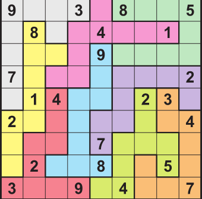

# Oumnia Aarich

# Irregular-sudoku
This is a final work for the subject Knowledge Representation
# Definition of sudoku : 
a puzzle in which missing numbers are to be filled into a 9 by 9 grid of squares which are subdivided into 3 by 3 boxes so that every row, every column, and every box contains the numbers 1 through 9. 

# How to solve this problem ? 
We will use " SWI-PROLOG" which offers a comprehensive free Prolog environment. Since its start in 1987, SWI-Prolog development has been driven by the needs of real world applications. it's widely used in research and education as well as commercial applications. 

To start my program based on the previous sudoko, i had to use the clpfd which is a library name by using the command ":- use_module(library(clpfd))", that will allow us to use the command all_distinct for example. 

First of all, we should create the sudoku we should create a sudoku grid with 9 coloums and 9 rows. After we have to indicate that the elements in the grid should be between 1 and 9. For each elements following a row or a column have to be distinct (for this we use the combination of "maplist" and "all_disctinct" command). 

The sudoku i have choosed is an irregular one named "sudoku2", so you can find bellow  the command needed to solve it on SWI-Prolog:

sudoku2(S), sudoku(S), maplist(label, S), maplist(portray_clause, S).

